# 🔵 SecureNet Segmentation

> 🔐 A hands-on Azure security project demonstrating network segmentation, least-privilege identity, and secrets management — built from a real audit finding, broken on purpose, and fixed for real.

<br/>


<br/>

🚀 **One-click deploy →** see [Deploy to Azure](#-quick-deploy) below

---

## 👀 Preview

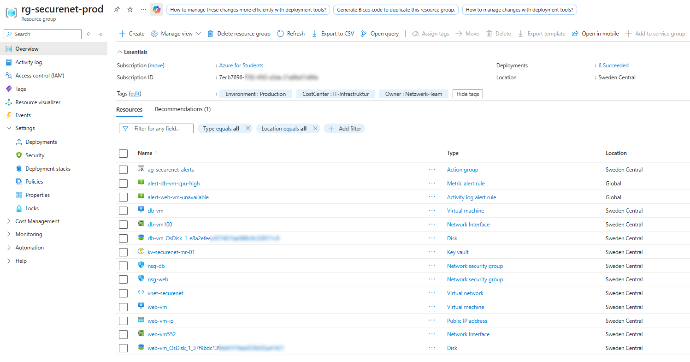

*All resources in `rg-securenet-prod`, Sweden Central — fully tagged, fully segmented.*

---

## 🧠 The Story

This project started with a real audit finding at a (simulated) mid-sized manufacturing company in Germany:

> **"Our web server and database server are on the same network. If the web tier gets compromised, the attacker has a direct path to the database — and the database credentials are sitting in plaintext in the application code."**

Most tutorials show you how to spin up a VNet and call it done. This project goes further: every security control here was **deliberately attacked to see if it actually holds** — not just configured and assumed to work.

> 💬 *"I didn't just write NSG rules and trust them. I SSH'd from one VM to the other and tried to break in. The first attempt actually got through — a default Azure rule I hadn't accounted for. Finding that gap, understanding why it existed, and closing it taught me more about NSG priority evaluation than any tutorial could."*

---

## 🏗️ Architecture

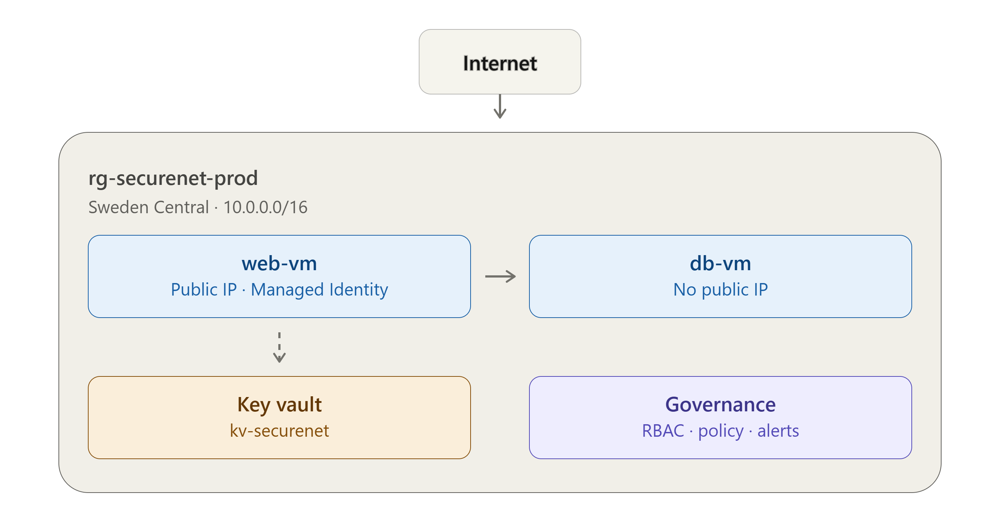

<details>
<summary>Text version (for plain-text readers)</summary>

```
Internet
   │ HTTP/HTTPS (80, 443) + SSH (office IP only, /32)
   ▼
┌────────────────────────────────────────────┐
│  snet-web (10.0.1.0/24)                     │
│  ┌────────────────────────────────────┐    │
│  │ web-vm (Public IP, Managed Identity) │    │
│  └────────────────────────────────────┘    │
└──────────────────┬───────────────────────────┘
                    │ Port 5432 only (NSG-enforced both ways)
                    ▼
┌────────────────────────────────────────────┐
│  snet-db (10.0.2.0/24)                      │
│  ┌────────────────────────────────────┐    │
│  │ db-vm (No Public IP)                 │    │
│  └────────────────────────────────────┘    │
└────────────────────────────────────────────┘

web-vm ──(Managed Identity, zero credentials)──► Key Vault (kv-securenet)
Entra ID (Netzwerk-Team) ──(Network-Operator custom RBAC role)──► Resource Group
Azure Policy ──(enforces tags + denies public IP on snet-db)──► Resource Group
Defender for Cloud ──(Secure Score + recommendations)──► Resource Group
Azure Monitor ──(CPU + Resource Health alerts)──► web-vm, db-vm
```

</details>

**Key principle:** the database tier is unreachable from the internet and unreachable from the web tier on any port except 5432. Both of those guarantees are backed by an actual exploitation attempt in the [Testing & Verification](#-testing--verification) section below — not just by reading the NSG rules and assuming they're correct.

---

## ✅ Features

- ✅ **Network segmentation** — isolated subnets for web and database tiers, connected only on the required port
- ✅ **Defense in depth** — layered NSG rules, including an explicit deny rule added specifically to close a default-rule gap (see Testing & Verification)
- ✅ **Least privilege identity** — a custom RBAC role written from scratch (`Network-Operator`), with no delete, no owner, no billing access
- ✅ **MFA enforced** — Security Defaults active on the tenant
- ✅ **Zero credentials in code** — database connection string lives in Key Vault, retrieved by web-vm via System Assigned Managed Identity
- ✅ **Governance as code** — two Azure Policies (mandatory tagging, no public IP on the database subnet), both validated with a real violation attempt
- ✅ **Security posture monitoring** — Microsoft Defender for Cloud Free tier, Secure Score tracked before/after
- ✅ **Proactive alerting** — CPU threshold alert and Resource Health alert, both wired to an Action Group
- ✅ **Infrastructure as Code** — ARM template export with parametrized inputs and a working one-click Deploy to Azure button
- ✅ **Cost-conscious by design** — built and tested for ~1-2 EUR total, using auto-shutdown and deallocation throughout

---

## 📁 Repository Structure

```
azure-securenet-segmentation-project/
├── README.md
├── infrastructure/
│   ├── arm/
│   │   └── network-template.json       # VNet + both NSGs, parametrized SSH source IP
│   ├── iam/
│   │   └── network-operator-role.json  # Custom RBAC role definition
│   └── policy/
│       └── deny-public-ip-db-subnet.json
└── docs/
    └── screenshots/
        ├── network/
        ├── identity-access/
        ├── key-vault/
        ├── governance/
        └── monitoring-iac/
```

---

<details>
<summary>🚀 <strong>Quick Deploy — click to expand</strong></summary>

<br/>

### Deploy the network layer with one click

[](https://portal.azure.com/#create/Microsoft.Template/uri/https%3A%2F%2Fraw.githubusercontent.com%2Fokayemre%2Fazure-securenet-segmentation-project%2Frefs%2Fheads%2Fmain%2Finfrastructure%2Farm%2Fnetwork-template.json)

This deploys `vnet-securenet`, both subnets, and both NSGs (with all security rules) directly into your own subscription. You'll be prompted for `allowedSshSourceIp` — replace the default with your own public IP in CIDR format (e.g. `1.2.3.4/32`) before deploying.

> This button deploys the network layer only (VNet + NSGs). VMs, Key Vault, RBAC role, and policies are intentionally excluded from the template to avoid embedding any identity-specific or secret-bearing configuration in a public file.

### Or explore the network via CLI

```bash
# List all NSG rules for the web tier
az network nsg rule list --resource-group "rg-securenet-prod" --nsg-name "nsg-web" --output table

# List all NSG rules for the database tier
az network nsg rule list --resource-group "rg-securenet-prod" --nsg-name "nsg-db" --output table

# Add a new inbound rule from the CLI
az network nsg rule create \
  --resource-group "rg-securenet-prod" \
  --nsg-name "nsg-web" \
  --name "Example-Rule" \
  --priority 120 \
  --direction Inbound \
  --access Allow \
  --protocol Tcp \
  --source-address-prefixes "*" \
  --destination-port-ranges 8080
```

</details>

---

## 🧪 Testing & Verification

Every control below was validated with an actual command, not just inspected in the Portal.

<details>
<summary><strong>1. SSH connectivity to web-vm</strong></summary>

<br/>

```
ssh -i ~/.ssh/id_rsa_azurelab azureuser@<web-vm-public-ip>
        ↓
Welcome to Ubuntu 24.04.4 LTS
azureuser@web-vm:~$
```

Confirms the NSG-Web inbound SSH rule (scoped to a single office IP) works as intended.

</details>

<details>
<summary><strong>2. NSG lateral movement test — found a real gap, then closed it</strong></summary>

<br/>

**First attempt — from web-vm, tried to SSH into db-vm:**

```
azureuser@web-vm:~$ ssh azureuser@10.0.2.4
azureuser@10.0.2.4: Permission denied (publickey).
```

This should have timed out, not reached the SSH daemon. Root cause: Azure's default `AllowVnetInBound` rule (priority 65000) permits **all ports** between subnets in the same VNet — and the custom NSG-DB rules only covered port 5432 and internet traffic, leaving every other port implicitly open to the rest of the VNet.

**Fix — added an explicit deny for all other VNet-internal traffic:**

```bash
az network nsg rule create \
  --resource-group "rg-securenet-prod" \
  --nsg-name "nsg-db" \
  --name "Deny-VNet-Other-Ports" \
  --priority 200 \
  --direction Inbound \
  --access Deny \
  --protocol "*" \
  --source-address-prefixes "VirtualNetwork" \
  --destination-port-ranges "*"
```

**Retest:**

```
azureuser@web-vm:~$ ssh azureuser@10.0.2.4
ssh: connect to host 10.0.2.4 port 22: Connection timed out
```

Port 5432 (the one port that should work) was re-verified separately and remained functional.

</details>

<details>
<summary><strong>3. Secrets retrieval via Managed Identity — zero credentials</strong></summary>

<br/>

From inside web-vm, using only the Azure Instance Metadata Service (no API key, no password, no file on disk):

```bash
TOKEN=$(curl -s 'http://169.254.169.254/metadata/identity/oauth2/token?api-version=2018-02-01&resource=https%3A%2F%2Fvault.azure.net' -H Metadata:true | python3 -c "import sys, json; print(json.load(sys.stdin)['access_token'])")

curl -s "https://kv-securenet-mr-01.vault.azure.net/secrets/db-connection-string?api-version=7.4" \
  -H "Authorization: Bearer $TOKEN"
```

```json
{
    "value": "Server=10.0.2.4;Database=appdb;Port=5432;User Id=dbadmin;Password=ChangeMe123!;",
    "attributes": { "enabled": true, ... }
}
```

The token is short-lived (`expires_in: 3599`) and was never stored anywhere — it exists only for the duration of the request.

</details>

<details>
<summary><strong>4. Azure Policy — both rules tested with a real violation attempt</strong></summary>

<br/>

**Policy 1 — resource without the `Environment` tag:**

```
az network public-ip create --resource-group "rg-securenet-prod" --name "test-policy-violation" --location "swedencentral"

(RequestDisallowedByPolicy) Resource 'test-policy-violation' was disallowed by policy.
Policy: "Require a tag on resources"
```

**Policy 2 — public IP attached to a NIC in the database subnet:**

```
az network nic create --resource-group "rg-securenet-prod" --name "test-nic-violation" \
  --vnet-name "vnet-securenet" --subnet "snet-db" --public-ip-address "test-pip-violation"

(RequestDisallowedByPolicy) Resource 'test-nic-violation' was disallowed by policy.
Policy: "Deny public IP on database subnet"
```

The same public IP attached successfully to a NIC in `snet-web`, confirming the custom policy is scoped correctly and doesn't over-restrict the web tier.

</details>

<details>
<summary><strong>5. Alert validation — confirmed organically, not just configured</strong></summary>

<br/>

While deallocating `web-vm` after testing, the Resource Health alert fired and produced a real notification email — without any synthetic load test:

```
Azure Monitor alert 'alert-web-vm-unavailable' was activated for 'WEB-VM'
currentHealthStatus: "Unavailable"
previousHealthStatus: "Available"
cause: "UserInitiated"
```

This confirms the Action Group, the Resource Health signal, and the Available → Unavailable transition logic all work end-to-end.

</details>

---

<details>
<summary>💰 <strong>Cost Breakdown — click to expand</strong></summary>

<br/>

Built and tested on an Azure for Students subscription, with cost discipline as an explicit constraint throughout.

| Resource | Tier | Cost |
|---|---|---|
| VNet, Subnets, NSGs, Tags | — | **Free** |
| Azure Policy | — | **Free** |
| Microsoft Entra ID, MFA (Security Defaults) | — | **Free** |
| Azure Monitor (metric + activity log alerts, email Action Group) | — | **Free** |
| Microsoft Defender for Cloud | Foundational CSPM | **Free** |
| Key Vault | Standard, pay-per-operation | ~€0.00 (a handful of test operations) |
| 2x Standard_B2ats v2 VMs | ~8-10 hours total runtime, with auto-shutdown + manual deallocation | ~€0.10-0.20 |
| **Total** | | **~€1-2** |

> Delete everything at once when done:
> ```bash
> az group delete --name rg-securenet-prod --yes --no-wait
> ```

</details>

---

## 📸 Screenshot Gallery

<details>
<summary><strong>🌐 Network</strong></summary>


*All resources in `rg-securenet-prod`.*

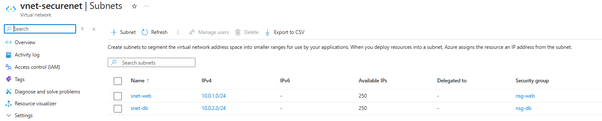
*`vnet-securenet` with `snet-web` and `snet-db`.*

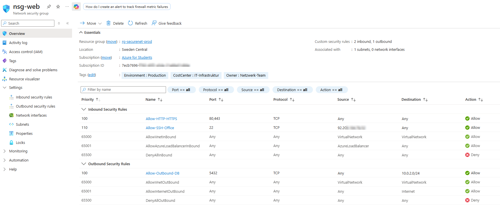
*Inbound and outbound rules for the web tier.*

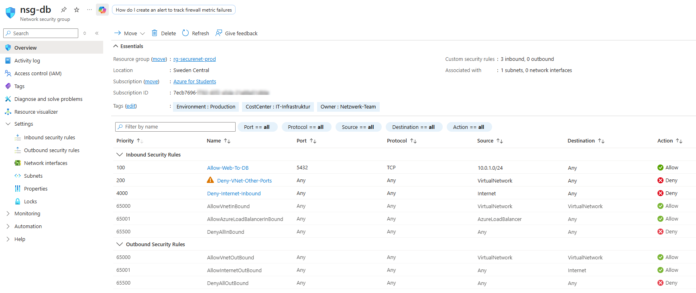
*Inbound rules for the database tier, including the `Deny-VNet-Other-Ports` fix.*

</details>

<details>
<summary><strong>🔐 Identity & Access</strong></summary>

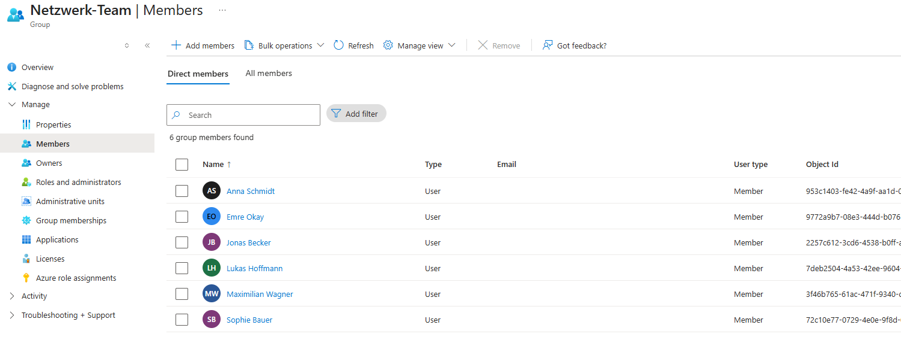
*The Entra ID security group.*

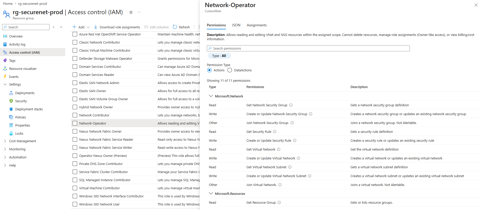
*The `Network-Operator` custom role definition.*

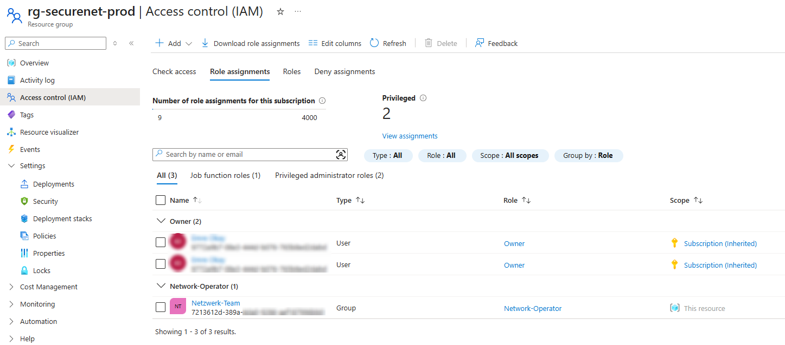
*`Network-Operator` assigned to `Netzwerk-Team` at the resource group scope.*

</details>

<details>
<summary><strong>🗝️ Key Vault</strong></summary>

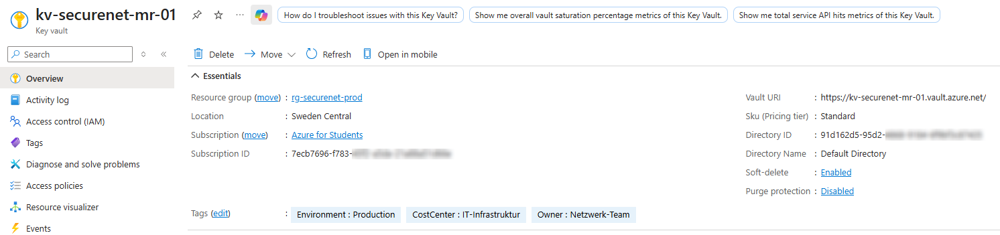

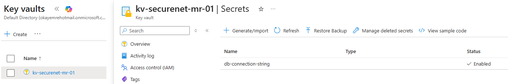
*Values hidden — only metadata is shown.*

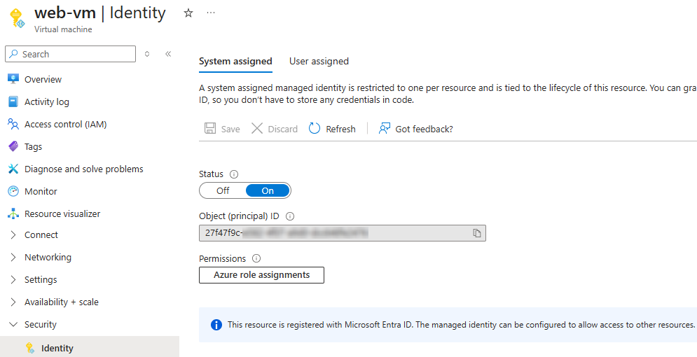

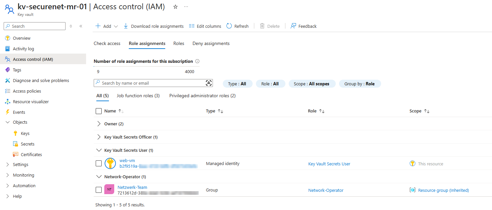
*`Key Vault Secrets User` assigned to web-vm's Managed Identity.*

</details>

<details>
<summary><strong>📋 Governance</strong></summary>

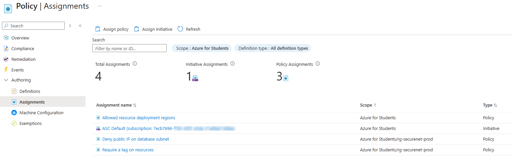

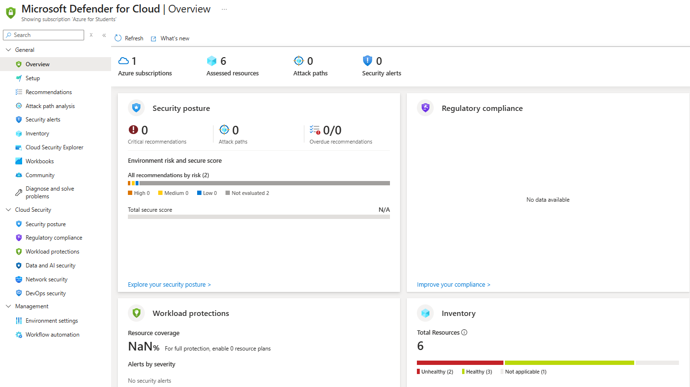

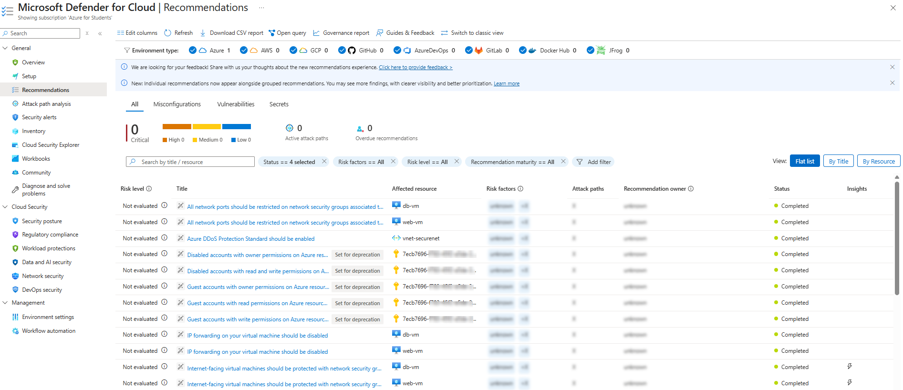
*Most foundational recommendations show as "Completed" without any remediation step — a direct result of the NSG rules, RBAC model, and lack of guest/legacy accounts already built earlier in this project. The one outstanding item (a vulnerability assessment solution) requires a paid Defender plan and was intentionally left disabled to stay within budget.*

</details>

<details>
<summary><strong>📊 Monitoring & IaC</strong></summary>

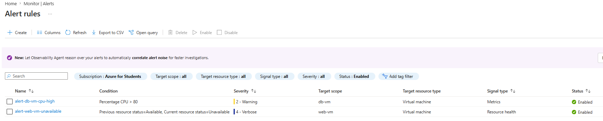

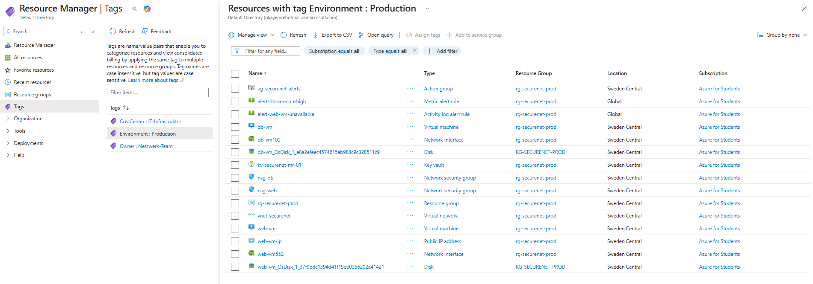

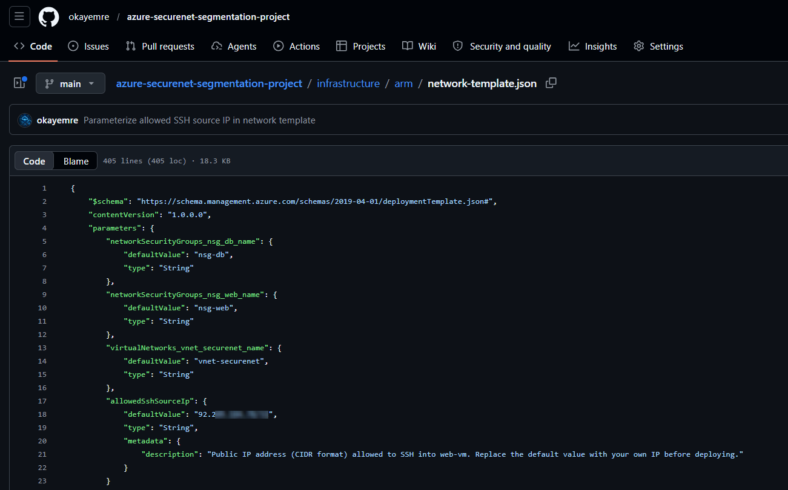

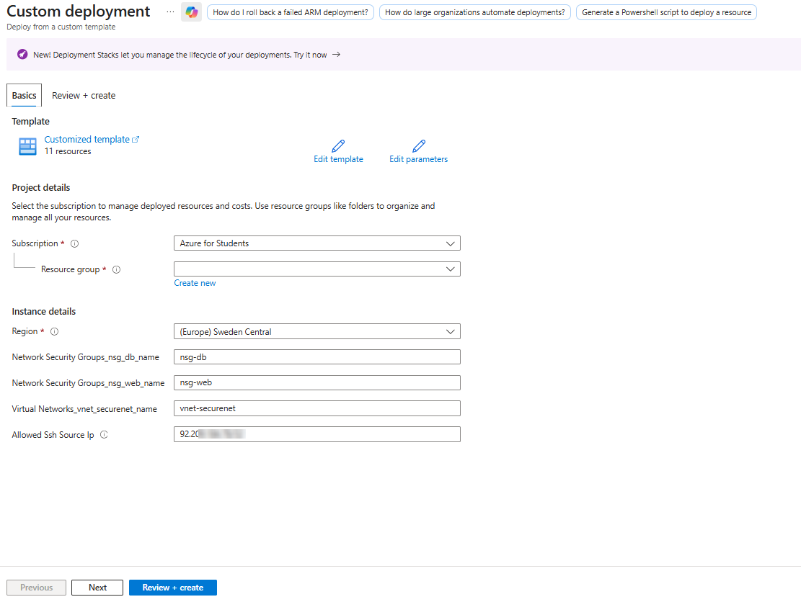
*The Custom Deployment screen correctly showing the `allowedSshSourceIp` parameter.*

</details>

---

## 🎓 What I Learned

- 🔓 A default Azure rule (`AllowVnetInBound`) silently permits all ports between subnets in the same VNet — segmentation isn't complete until you explicitly deny what you didn't ask to allow
- ⏱️ RBAC and Policy role assignments aren't instant — they propagate over a few minutes, and testing too early produces misleading "Forbidden" results
- 🧪 A passing configuration in the Portal doesn't mean a working control — every NSG rule, every policy, and every alert in this project was confirmed with an actual attempt to break it
- 🌐 `raw.githubusercontent.com` is served through a CDN with its own caching layer, separate from GitHub's own UI — a file can look correct in the GitHub blob view and still serve stale content to a "Deploy to Azure" button for several minutes
- 🔑 Managed Identity removes the hardest part of secrets management — there's no key to rotate, leak, or forget, because there's no key at all
- 💸 Auto-shutdown and explicit deallocation are not optional when working with a limited student credit — and documenting that discipline is itself a portfolio signal
- 🧭 Subscription-level Owner doesn't guarantee tenant-level visibility for cross-cutting tools like Defender for Cloud — its inventory stayed empty for hours despite the resource provider being registered, the `ASC Default` policy correctly assigned, and Foundational CSPM active. Assigning a tenant-root Security Reader role (via Defender's "Get permissions" flow) and manually triggering a policy compliance scan (`az policy state trigger-scan`) is what finally surfaced the inventory

---

## 🏭 Production Considerations

This project deliberately makes a few cost- and scope-driven trade-offs. In a production environment, the following would change:

- **Bastion instead of NSG-restricted SSH** — removes the need for any public IP on the management path entirely
- **NAT Gateway for snet-db** — controlled, logged egress instead of relying on default outbound access
- **Private Endpoint for Key Vault** — removes the public endpoint entirely, restricting access to the VNet
- **Conditional Access (Entra ID P1/P2)** — scoped MFA policies per group, instead of tenant-wide Security Defaults
- **Defender for Servers / CSPM paid tier** — agentless vulnerability scanning and advanced threat detection

---

## 📄 License

MIT © 2026